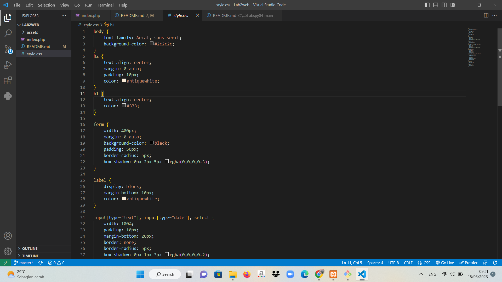
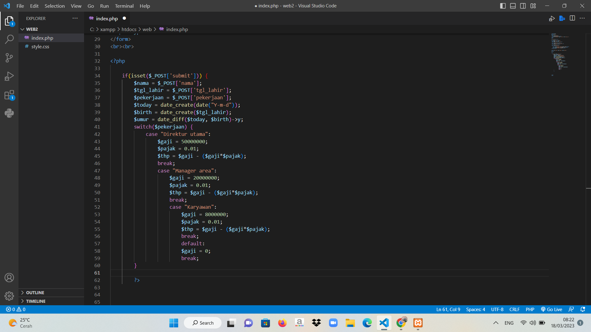
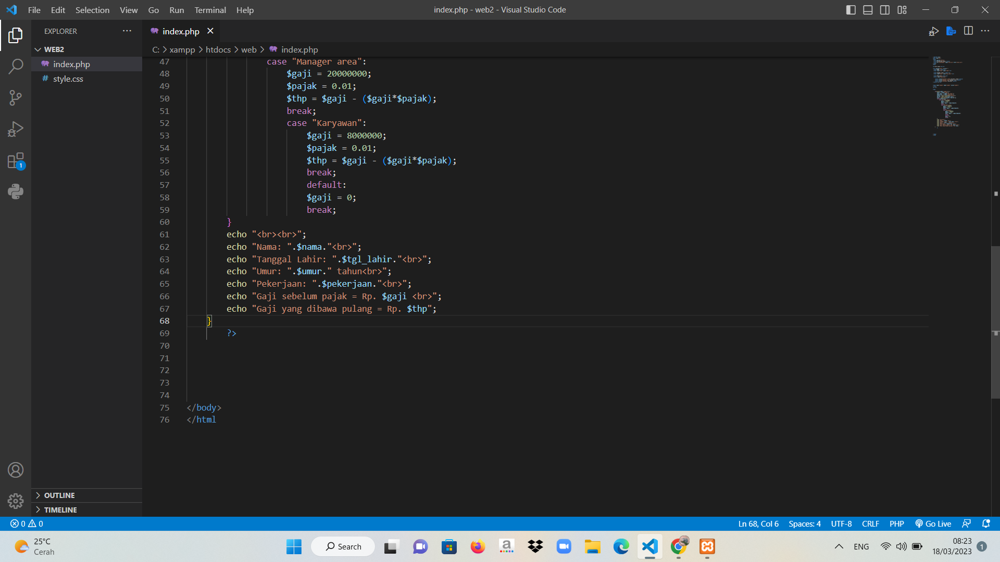

# Lab2web
## Langkah - Langkah
Berikut ini adalah langkah langkah membuat form input yang menampilkan nama, tanggal lahir, dan pekerjaan yang mana akan menghitung umur berdasarkan inputan tanggal lahir dan menampilkan gaji yang berbeda-beda sesuai dengan pilihan pekerjaannya.


1. Code *HTML*
- Tambahkan code **HTML** untuk membuat *form input dengan tiga field, yaitu Nama, Tanggal Lahir, dan Pekerjaan.* :

- **Gambar**   


2. Code *CSS*
- Untuk memperindah hasilnya kita bisa menggunakan css dengan membuat file **style.css**
- berikut ini adalah codingan untuk menyambungkan file index.php dengan css 

```html
<link rel="stylesheet" type="text/css" href="style.css">
```
- Di bawah ini adalah code css nya :
- **Gambar**


3. code *PHP*
- Setelah mendefinisikan variabel $nama, $tgl_lahir, dan $pekerjaan dari input form, kita menghitung umur berdasarkan tanggal lahir menggunakan fungsi date_diff() dari PHP. Setelah itu, kita menggunakan struktur switch untuk menentukan gaji dan pajak yang akan diberikan berdasarkan pilihan pekerjaan yang dipilih.
- Pada kasus ini, terdapat tiga pilihan pekerjaan yaitu "Direktur utama", "Manager area", dan "Karyawan". Jika pilihan pekerjaan adalah "Direktur utama", maka gaji yang diterima adalah Rp50.000.000,- dengan pajak sebesar 1%. Jika pilihan pekerjaan adalah "Manager area", maka gaji yang diterima adalah Rp20.000.000,- dengan pajak sebesar 1%. Jika pilihan pekerjaan adalah "Karyawan", maka gaji yang diterima adalah Rp8.000.000,- dengan pajak sebesar 1%. Jika tidak ada pilihan pekerjaan yang dipilih atau input pekerjaan tidak sesuai, maka gaji yang diterima adalah 0.
- Variabel $thp digunakan untuk menyimpan take home pay atau gaji bersih yang diterima setelah dikurangi pajak. Pada setiap pilihan pekerjaan, nilai $thp dihitung dengan mengurangi gaji dengan pajak yang sudah dihitung sebelumnya.
- **Gambar**
  
- Setelah menghitung umur dan menentukan gaji dan pajak yang akan diterima, langkah selanjutnya adalah menampilkan output ke layar. Pada bagian ini, kita menggunakan echo untuk nampilin/Ngeprint nama, tanggal lahir, umur, pekerjaan, gaji sebelum pajak, dan gaji bersih yang diterima.
- Variabel $nama, $tgl_lahir, $umur, $pekerjaan, $gaji, dan $thp digunakan untuk menampilkan data yang sudah dihitung sebelumnya. Kita menggunakan tag HTML <br> untuk membuat baris baru agar output lebih rapih dan mudah dibaca.
- Pada bagian gaji, kita menambahkan tanda koma sebagai pemisah ribuan untuk mempermudah pembacaan dan memberikan tampilan yang lebih bagus.
- **Gambar**


## SEKIAN TERIMA KASIH !!!
