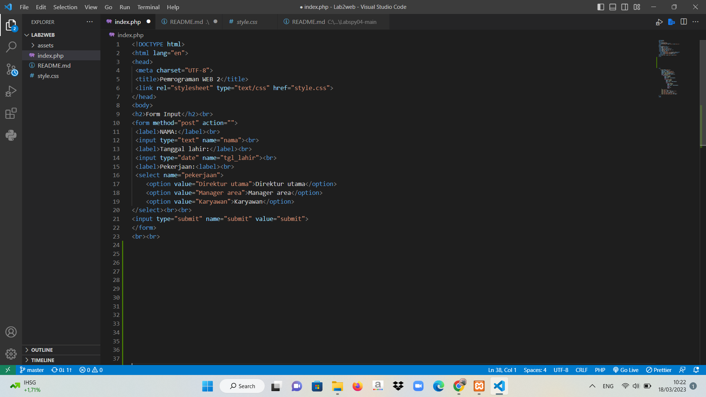

# Lab2web
## Langkah - Langkah
Berikut ini adalah langkah langkah membuat form input yang menampilkan nama, tanggal lahir, dan pekerjaan yang mana akan menghitung umur berdasarkan inputan tanggal lahir dan menampilkan gaji yang berbeda-beda sesuai dengan pilihan pekerjaannya.

1.
Tambahkan kode HTML untuk membuat form input dengan mengetikkan perintah berikut :

- *Gambar*


```html
<link rel="stylesheet" type="text/css" href="style.css">
```html
